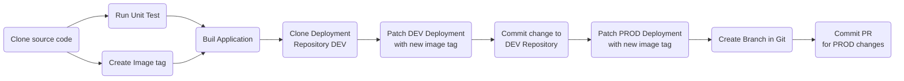

# Continuous Integration using OpenShift GitOps

We assume that you are in the folder that you have clone/fork the code. For instructions on how to install OpenShift Gitops you can refer to my [OpenShift GitOps Demo](https://github.com/froberge/ocp-gitops-demo) in this [section](https://github.com/froberge/ocp-gitops-demo/blob/main/docs/install-gitops-operator.md)


In this section we will be demontrating how to use `OpenShift` gitops to manage and deploy your application. To achieve this we will ne deploying another `ArgoCD instance` that will be use by developers to manage the applications.

__NOTE__
*   The default `cluster` instance of Argo CD is meant for cluster admin tasks like creating namespace managing role bindings not for day to day application management.

* `The Developer Argo CD instance` will be deploy in it own namespaces and is intented to manage the application.

1. Login to you cluster using the CLI

1. Use `Kustomize` to create the different resources needed to run the demo 
    ```
    oc apply -k setup/overlays/demo
    ```

    This will create all the elements required    
        * __simple-dotnet-gitops__ - The namespace where the argoCD instance for Developer will be install.
        * __simple-dotnet-dev__ - The `DEV` environment for the demo.
        * __simple-dotnet-prod__ - The `PROD` environment for the demo.

### The Automation Flow.  

The automation flow uses a mix of `Azure DevOps Pipeline` and `ArgoCD`.

The Azure DevOps Pipeline manage the `Continuous Integration` part of the CI/CD pratice. The pipeline is responsible to build the application and modify the deployment artifact with the right image tag. ArgoCD monitor the changes in the repository and is responsiple cor the `Continuous Delivery` part. GitOps Pipeline with deploy/update the application inside `OpenShift` according to what's in the git repository.




#### Make different modification to the application to test the pipeline.

* Modify the source code will trigger the pipeline build in Azure DevOps -> `C`ontinuous `I`ntegrations
* Modify the deployment code will trigger change to the Cluster configuration -> `C`ontinuous `D`elivery


:tada: CONGRATULATIONS

You have now deploy the service using OpenShift GitOps.
